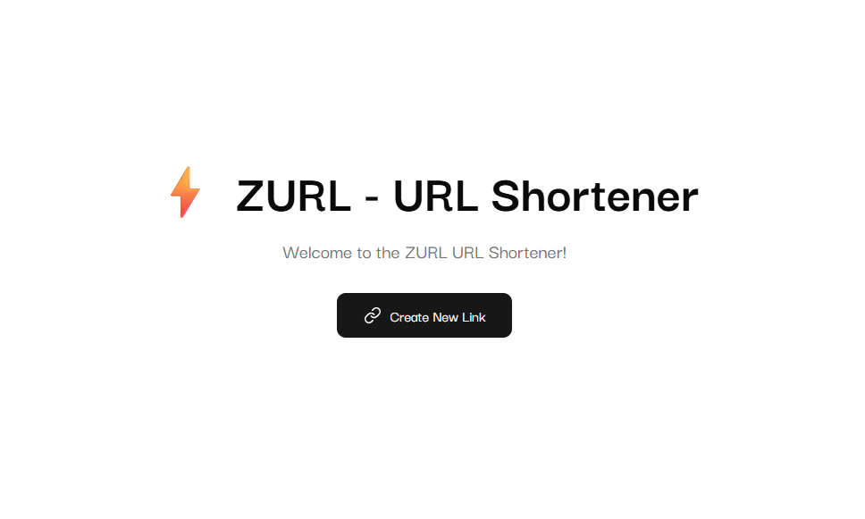

# ⚡ ZURL - URL Shortener

Welcome to **ZURL**, a modern, blazing-fast URL shortener built with the latest web technologies. Easily generate and share short, trackable links from a clean, responsive UI.

---

## 🚀 Features

- 🔗 Shorten long URLs quickly
- 📈 Optional click analytics tracking
- 🔒 Unique slug generation per machine using hashed IDs and counters
- 📁 Store links with metadata like title, creation time, and analytics toggle
- ⚡ Instant redirection using tRPC with no UI flash
- 🧠 Form validation with Zod (v4)

---

## 🧰 Tech Stack

| Layer      | Technology                                       |
| ---------- | ------------------------------------------------ |
| Framework  | [Next.js](https://nextjs.org) (App Router)       |
| Language   | TypeScript                                       |
| Styling    | Tailwind CSS, [shadcn/ui](https://ui.shadcn.com) |
| Backend    | tRPC (Server & Client)                           |
| ORM        | Prisma                                           |
| Database   | MongoDB                                          |
| Caching    | Redis (planned)                                  |
| Validation | [Zod v4](https://zod.dev)                        |
| Hosting    | [Vercel](https://vercel.com) (Recommended)       |

---
